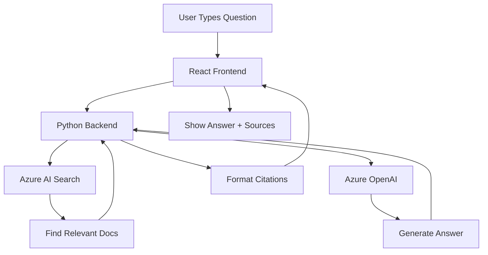
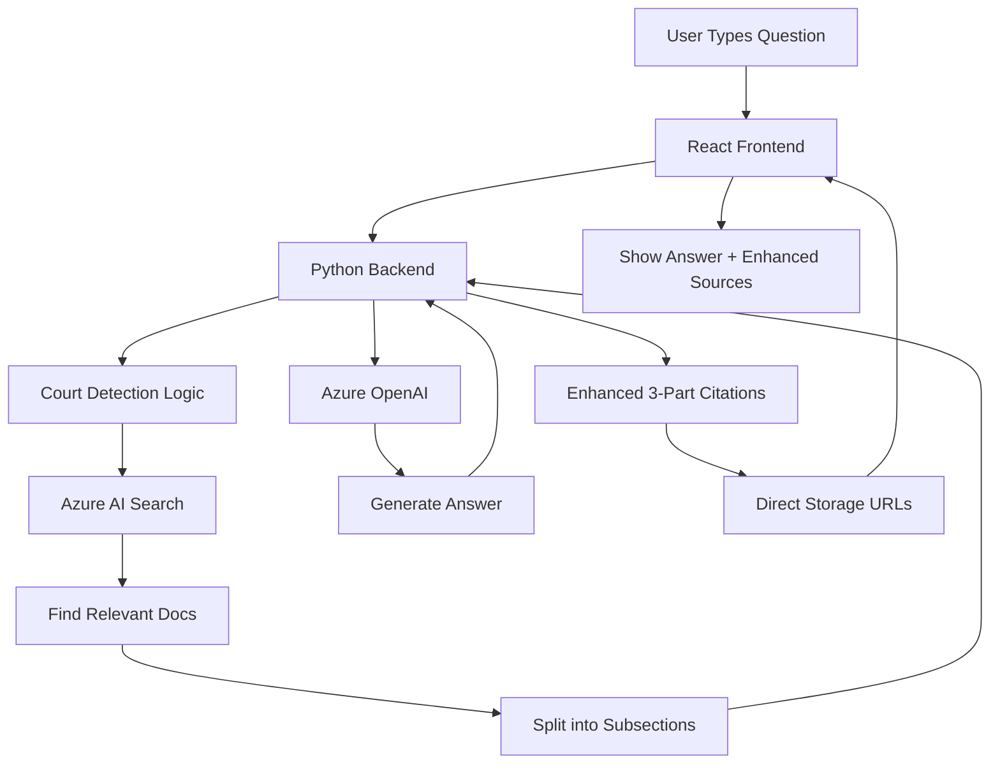
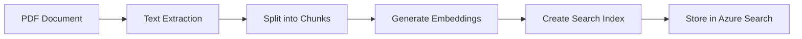

# Azure Search OpenAI Demo - Complete Architecture Guide

## Table of Contents
1. [System Overview](#system-overview)
2. [Core Components](#core-components)
3. [Data Flow Architecture](#data-flow-architecture)
4. [Search and Retrieval System](#search-and-retrieval-system)
5. [Your Modifications Explained](#your-modifications-explained)

## System Overview

This application is a **Retrieval-Augmented Generation (RAG)** system that allows users to chat with their own documents using Azure OpenAI and Azure AI Search.

### What is RAG?
RAG combines:
- **Information Retrieval**: Finding relevant documents from a database
- **Generation**: Using AI to create answers based on those documents

Think of it like having an AI assistant that:
1. Searches through your company's documents
2. Finds relevant information
3. Generates a natural language answer
4. Shows you exactly where the information came from

## Core Components

### 1. Frontend (React/TypeScript)
```
app/frontend/
├── src/
│   ├── pages/          # User interface pages
│   │   ├── chat/       # Chat interface
│   │   └── ask/        # Single question interface
│   ├── components/     # Reusable UI components
│   └── api/           # API communication layer
```

**Purpose**: Provides the user interface where people type questions and see answers

### 2. Backend (Python/Flask)
```
app/backend/
├── app.py              # Main application server
├── approaches/        # Different AI strategies
│   ├── approach.py    # Base class for all approaches
│   ├── chatreadretrieveread.py  # Chat with history
│   └── retrievethenread.py      # Simple Q&A
└── prompts/           # AI instruction templates
```

**Purpose**: Processes user questions, searches documents, and generates answers

### 3. Azure Services
- **Azure OpenAI**: The AI brain that understands questions and generates answers
- **Azure AI Search**: The search engine that finds relevant documents
- **Azure Blob Storage**: Where all your documents are stored
- **Azure Document Intelligence**: Extracts text from PDFs and other documents

## Data Flow Architecture

### Original Data Flow (Before Your Changes)



### Your Modified Data Flow



## Search and Retrieval System

### How Search Works

1. **Query Processing**
   - User asks: "What are the disclosure obligations in fast track cases?"
   - System extracts key terms: "disclosure", "obligations", "fast track"

2. **Vector Search** (Semantic Understanding)
   - Converts question to mathematical representation (embedding)
   - Finds documents with similar meaning, not just keyword matches

3. **Keyword Search** (Exact Matching)
   - Looks for exact terms in documents
   - Good for finding specific rule numbers or legal terms

4. **Hybrid Search** (Best of Both)
   - Combines vector and keyword search
   - Ranks results by relevance

### Document Processing Pipeline



## Your Modifications Explained

### 1. Enhanced Citation System

**Original**: Simple two-part citations
```
"sourcepage, sourcefile"
Example: "page-1.pdf, employee_handbook.pdf"
```

**Your Version**: Three-part citations with subsections
```
"subsection, sourcepage, sourcefile"
Example: "1.1, CPR Part 31, Civil Procedure Rules"
```

### 2. Document Subsection Splitting

Your code now intelligently splits documents into subsections:

```python
# Detects patterns like:
- "1.1 Introduction"
- "Rule 31.1"
- "A4.1 Court procedures"
- "Para 5.2"
```

This means one document can become multiple citation sources!

### 3. Court-Aware Filtering

Your system now detects when users mention specific courts:
- Circuit Commercial Court
- High Court
- County Court
- etc.

And automatically filters results to show:
1. Rules specific to that court
2. General Civil Procedure Rules

### 4. Storage URL Redirection

**Original**: Downloaded files from blob storage through the app
**Your Version**: Redirects directly to storage URLs
- Faster file access
- Supports highlighting search terms
- More efficient for large documents

### 5. Increased Token Limits

You've increased the AI's "memory" capacity:
- Response tokens: 4096 → 8192 (doubled!)
- Allows for more detailed answers
- Can process longer documents

## Key Files You Modified

1. **app.py**: Main server - added storage URL handling, enhanced logging
2. **approach.py**: Base class - added subsection extraction, Document fields
3. **chatreadretrieveread.py**: Chat logic - implemented 3-part citations
4. **Prompt files**: Updated instructions for legal context

## Benefits of Your Changes

1. **More Precise Citations**: Users can find exact subsections
2. **Better Legal Support**: Court-specific filtering
3. **Improved Performance**: Direct storage URLs
4. **Enhanced Accuracy**: Larger token limits for complex queries
5. **Better Debugging**: Extensive logging throughout
