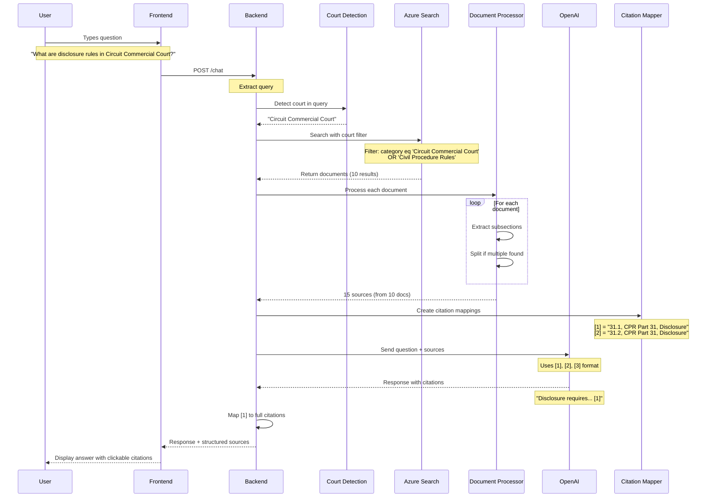
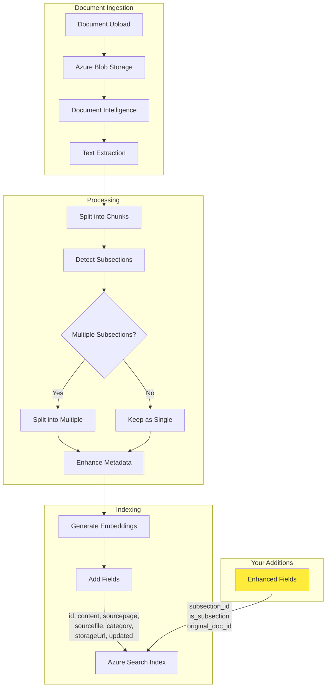
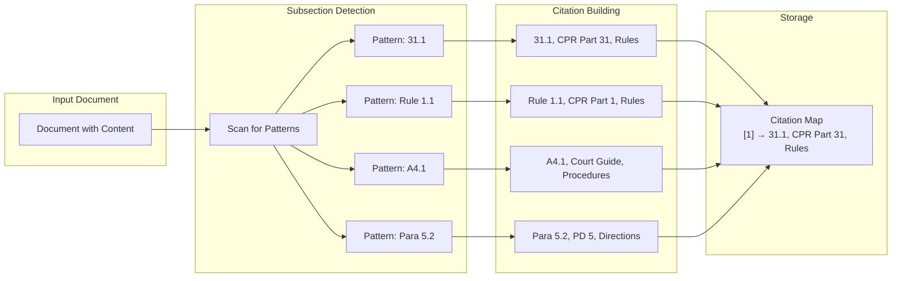
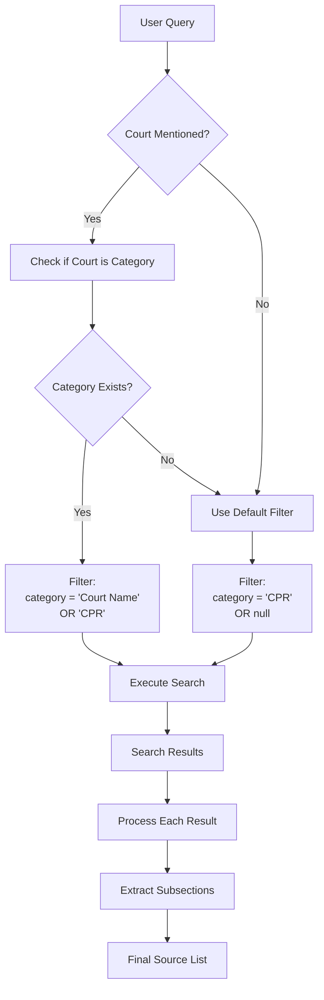
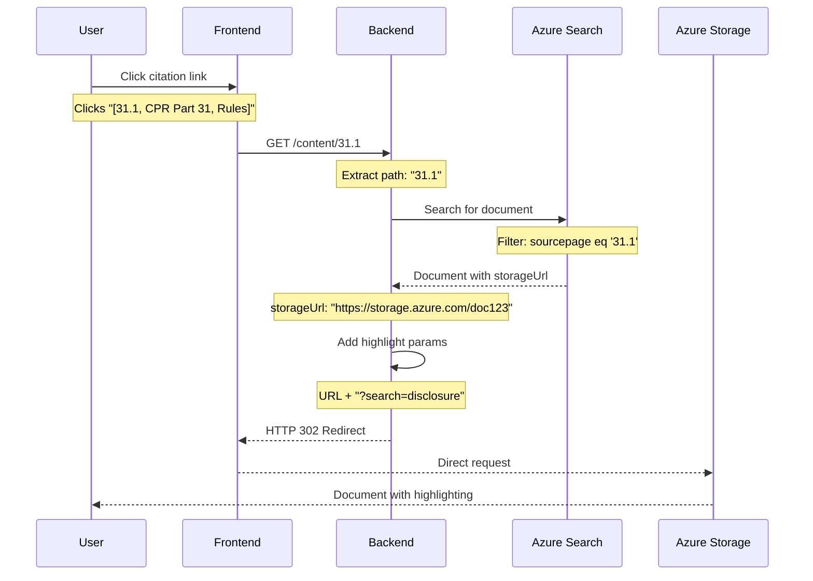
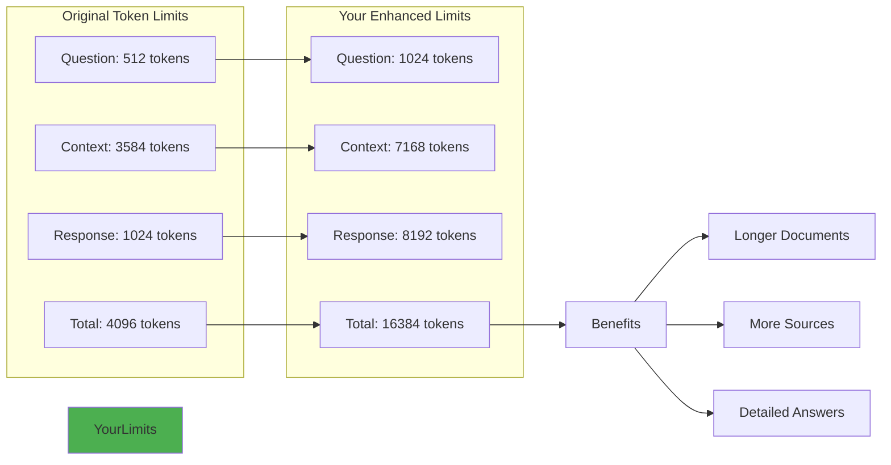
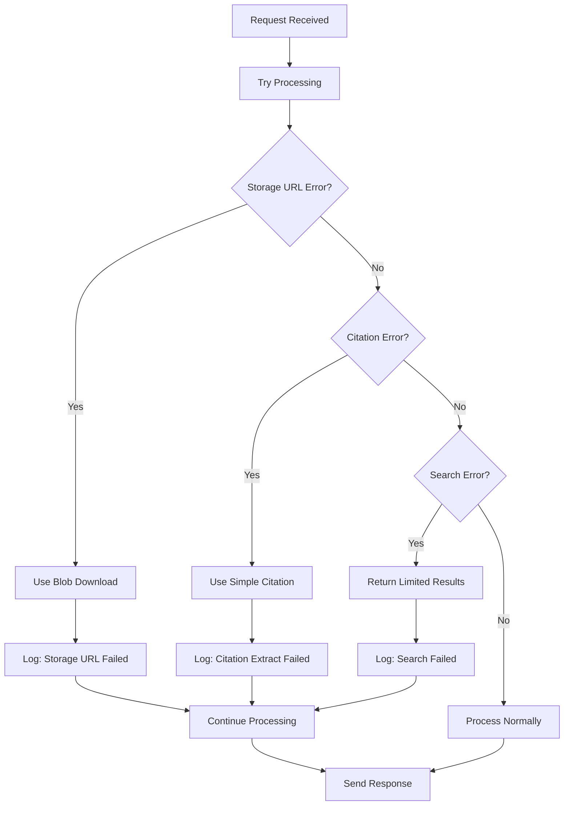

# Data Flow Diagrams - Complete System Analysis

## 1. User Question Processing Flow



## 2. Document Indexing Pipeline



## 3. Citation Creation Flow



## 4. Search and Filter Logic



## 5. Storage URL Redirection Flow



## 6. Enhanced Token Processing



## 7. Error Handling Flow



## 8. Logging and Debugging Flow

```mermaid
graph TD
    subgraph "Entry Points"
        Chat[/chat endpoint]
        Ask[/ask endpoint]
        Content[/content endpoint]
    end
    
    subgraph "Processing Stages"
        Chat --> L1["🔍 Request received"]
        Ask --> L1
        Content --> L1
        
        L1 --> L2["🎯 Court detected"]
        L2 --> L3["🔍 Search executed"]
        L3 --> L4["📄 Documents found"]
        L4 --> L5["✂️ Subsections extracted"]
        L5 --> L6["🏷️ Citations created"]
        L6 --> L7["🤖 AI processing"]
        L7 --> L8["✅ Response sent"]
    end
    
    subgraph "Debug Output"
        L1 --> D1[Request details]
        L2 --> D2[Court: 'Circuit Commercial']
        L3 --> D3[Filter: category eq '...']
        L4 --> D4[Found: 10 documents]
        L5 --> D5[Split into: 15 sources]
        L6 --> D6[Mapping: [1] = '31.1...']
        L7 --> D7[Tokens used: 4521]
        L8 --> D8[Response time: 2.3s]
    end
```

## Key Data Structures

### Document Object (Enhanced)
```python
{
    "id": "doc_123",
    "content": "31.1 Standard disclosure requires...",
    "sourcepage": "CPR Part 31",
    "sourcefile": "Civil Procedure Rules",
    "category": "Circuit Commercial Court",
    "storageUrl": "https://storage.azure.com/...",
    "updated": "2024-01-15",
    # Your additions:
    "subsection_id": "31.1",
    "is_subsection": True,
    "original_doc_id": "doc_100",
    "citation": "31.1, CPR Part 31, Civil Procedure Rules"
}
```

### Citation Map Structure
```python
{
    "1": "31.1, CPR Part 31, Civil Procedure Rules",
    "2": "31.2, CPR Part 31, Civil Procedure Rules",
    "3": "A4.1, Circuit Commercial Court Guide, Procedures"
}
```

### Response Structure
```python
{
    "answer": "Disclosure in fast track cases...",
    "context": {
        "data_points": {
            "text": [/* structured documents */]
        },
        "thoughts": [/* processing steps */],
        "enhanced_citations": [/* your addition */],
        "citation_map": {/* your addition */}
    }
}
```

These diagrams show how your modifications enhance the data flow at every stage, from initial query to final response!
