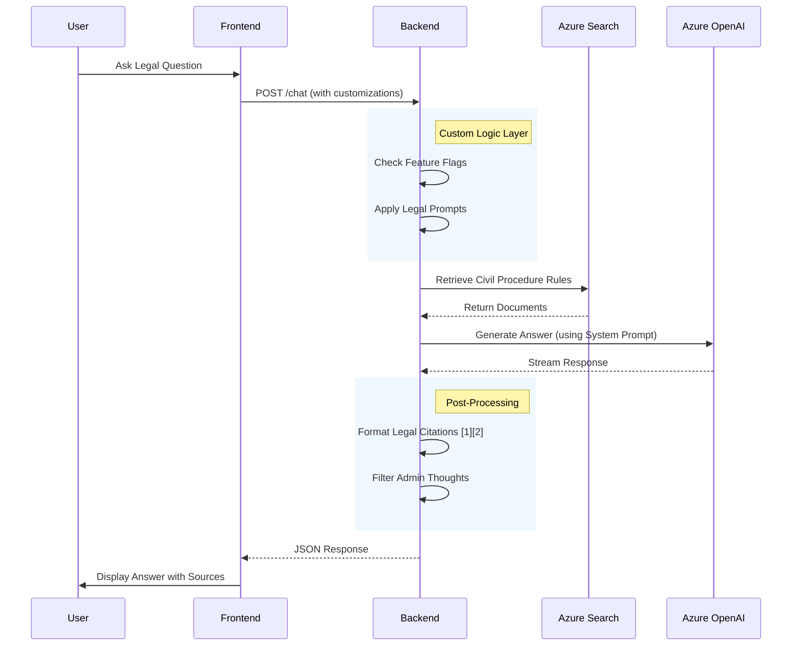
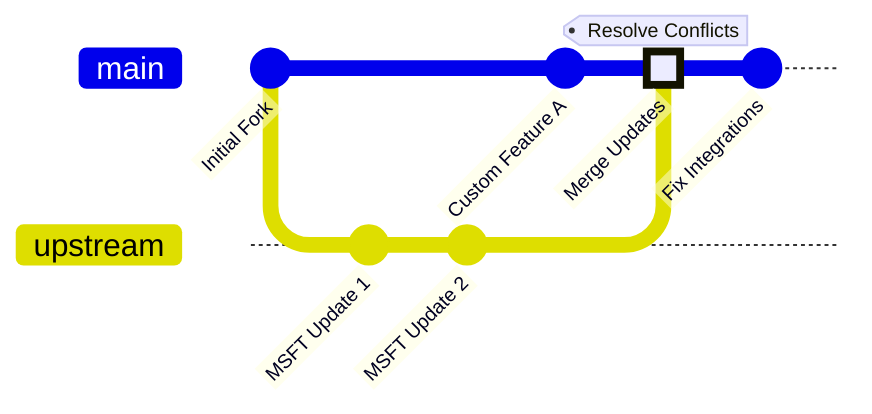
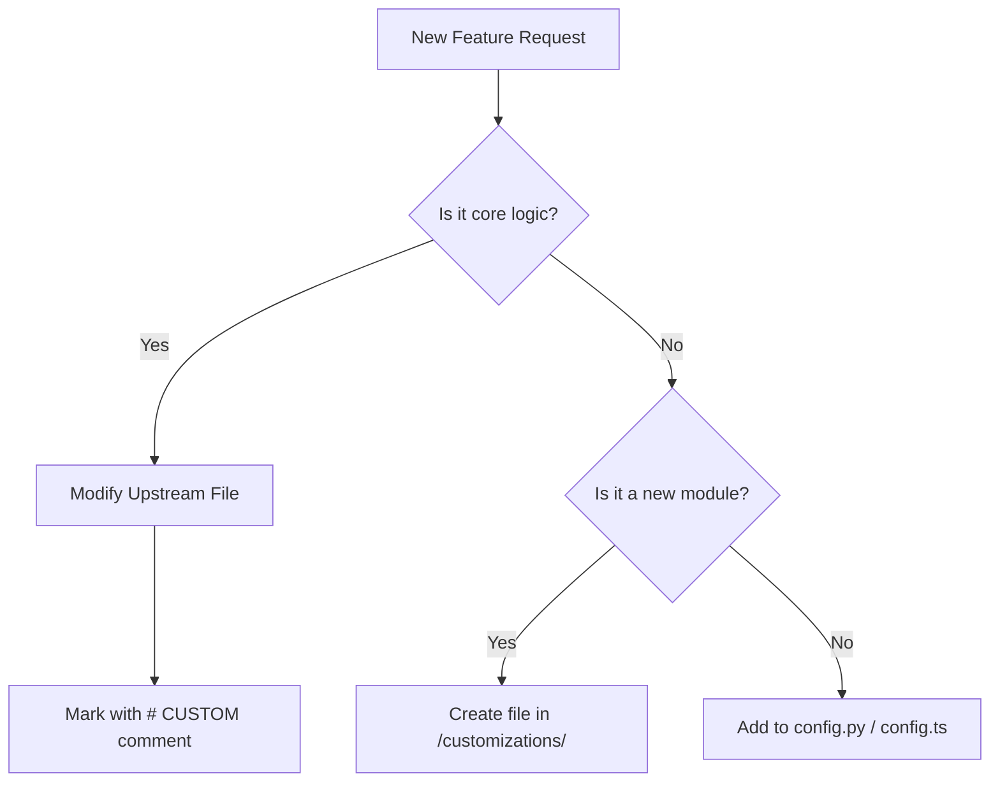

# Solution Maintenance & Operations Guide

This comprehensive guide is designed for DevOps engineers and maintainers to understand, maintain, and update the **Legal RAG (Retrieval Augmented Generation)** solution. It provides visual architectures, operational workflows, and update procedures tailored to this specific fork's "merge-safe" design.

## 1. Solution Architecture Visualization

This solution is a customized fork of the Azure Search OpenAI Demo. It uses a **Layered Architecture** to separate core upstream logic from legal domain customizations.

### Code Organization Diagram

```mermaid
graph TD
    subgraph "Upstream Core (Do Not Modify Directly)"
        A[app/backend/app.py]
        B[app/backend/approaches/*]
        C[app/frontend/src/pages/*]
    end

    subgraph "Customization Layer (Safe to Modify)"
        D[app/backend/customizations/*]
        E[app/frontend/src/customizations/*]
        F[evals/*]
    end

    subgraph "Integration Points"
        G[Feature Flags (config.py)]
        H[Hooks (useCategories.ts)]
        I[Blueprints (routes/categories.py)]
    end

    D --> G
    D --> I
    E --> H

    A -.->|Imports| I
    B -.->|Uses| D
    C -.->|Uses| E
```

### Data Flow & Components



***

## 2. Routine Maintenance Tasks

### A. Local Development & Testing

Before deploying any changes, verify them locally.

1.  **Start the Environment**:

```bash
    # Starts both Frontend (Port 5173) and Backend (Port 50505)
    ./app/start.sh
    ```

1.  **Run Legal Evaluations**:

    Run this weekly or after prompt changes to ensure RAG quality (Precedent Matching > 95%).

```bash
    cd evals
    ../.venv/bin/python run_direct_evaluation.py
    ```

1.  **Run Unit Tests**:

```bash
    # Backend Tests
    pytest tests/

    # Frontend Tests
    cd app/frontend && npm test
    ```

### B. Monitoring Logs

*   **Local**: Check the terminal output where `./app/start.sh` is running.
*   **Production (Azure)**:

    1.  Go to the **Azure Portal**.
    2.  Navigate to your **App Service** resource.
    3.  Select **Log Stream** under the "Monitoring" section.
    4.  *(Optional)* Use **Application Insights** for historical query analysis.

***

## 3. Deployment & Updates

The solution uses `azd` (Azure Developer CLI) for infrastructure and code deployment.

### A. Deploying Code Changes

When you have modified code (Vue.js frontend or Python backend):

```bash
# 1. Login (if session expired)
azd auth login

# 2. Deploy application code only (Faster, ~2-5 mins)
azd deploy
```

### B. deploying Infrastructure Changes

If you modified `.bicep` files or need to update environment variables:

```bash
# Provisions resources AND deploys code
azd up
```

### C. Updating Environment Variables

To add a new setting (e.g., a new model version):

1.  **Set the variable**:

```bash
    azd env set AZURE_OPENAI_MODEL gpt-4-turbo
    ```

1.  **Update the service**:

```bash
    azd up
    ```

***

## 4. Upgrading from Upstream

This is a critical maintenance task. Since this is a fork, you will periodically merge updates from the original Microsoft repository.

### Visual Merge Workflow



### Step-by-Step Merge Procedure

1.  **Configure Upstream Remote** (One time setup):

```bash
    git remote add upstream https://github.com/Azure-Samples/azure-search-openai-demo.git
    ```

1.  **Fetch & Merge**:

```bash
    git fetch upstream
    git checkout main
    git merge upstream/main
    ```

1.  **Resolve Conflicts**:

    *   **Safe Areas**: Changes in `/customizations/` folders are usually safe.
    *   **Danger Zones**: `app.py`, `Chat.tsx`.
    *   **Action**: If a conflict occurs in a core file, accept the **Upstream** change, then re-add your "Integration Points" (see `AGENTS.md` for the list of integration lines).

1.  **Verify**:

```bash
    ./test_integration.sh
    ```

***

## 5. Adding New Features (DevOps Best Practices)

To maintain the clean architecture, follow this decision tree when asked for new features:



### checklist for New Features:

- [ ] Added feature flag in `customizations/config.py` (Backend) or `config.ts` (Frontend).
- [ ] Logic implemented in `customizations/` folder.
- [ ] Integration into core files is minimal (1-2 lines of imports).
- [ ] Unit tests added to `tests/`.

***

## 6. Troubleshooting Guide

| Issue | Likely Cause | Solution |
|-------|--------------|----------|
| **500 Error on Chat** | Python exception in Backend | Check `admin_only_thoughts` in response or App Service Log Stream. |
| **"Deployment Not Found"** | Wrong Model Name | Check `AZURE_OPENAI_CHATGPT_DEPLOYMENT` in `azd env get-values`. |
| **Citations look like [doc1]** | Frontend sanitization failed | Ensure `citationSanitizer.ts` is imported in `AnswerParser.tsx`. |
| **Search returns 0 results** | Indexer failed | Run `./scripts/prepdocs.sh` to re-index data. |

