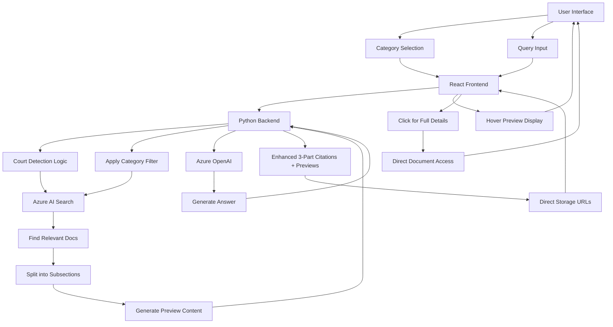

# Azure Search OpenAI Demo - Complete Architecture Guide

## Table of Contents

1. [System Overview](#system-overview)
1. [Core Components](#core-components)
1. [Data Flow Architecture](#data-flow-architecture)
1. [Search and Retrieval System](#search-and-retrieval-system)
1. [Enhanced User Interface Features](#enhanced-user-interface-features)
1. [Your Modifications Explained](#your-modifications-explained)

## System Overview

This application is a **Retrieval-Augmented Generation (RAG)** system enhanced for legal professionals that allows users to interact with legal documents using Azure OpenAI and Azure AI Search with advanced features like category selection, hover previews, and intelligent court detection.

### What is RAG?

RAG combines:

- **Information Retrieval**: Finding relevant documents from a database
- **Generation**: Using AI to create answers based on those documents
- **User Interaction**: Your enhancements add professional-grade UI features

Think of it like having an AI legal assistant that:

1. Understands what court or category you're interested in
1. Searches through legal documents intelligently
1. Shows preview information on hover
1. Generates answers with precise citations
1. Provides direct access to source documents

## Core Components

### 1. Enhanced Frontend (React/TypeScript)

```text
app/frontend/
├── src/
│   ├── pages/          # User interface pages
│   │   ├── chat/       # Chat interface with category selection
│   │   └── ask/        # Single question interface with filters
│   ├── components/     # Enhanced UI components
│   │   ├── Answer/     # Interactive citations with hover
│   │   ├── SupportingContent/  # Enhanced citation display
│   │   └── AnalysisPanel/      # Category-aware panel
│   └── api/           # API communication layer
```

**Purpose**: Provides an enhanced legal research interface with:

- Category selection dropdown
- Hover citation previews
- Interactive citation management
- Court-specific filtering controls

### 2. Enhanced Backend (Python/Flask)

```text
app/backend/
├── app.py              # Enhanced server with storage URL handling
├── approaches/        # Enhanced AI strategies
│   ├── approach.py    # Base class with subsection extraction
│   ├── chatreadretrieveread.py  # Court-aware chat with citations
│   └── retrievethenread.py      # Enhanced Q&A with filtering
└── prompts/           # Legal-focused AI instruction templates
```

**Purpose**: Processes user questions with:

- Intelligent court detection
- Category-aware search filtering
- Enhanced citation building
- Preview content generation

### 3. Azure Services (Unchanged but Enhanced Usage)

- **Azure OpenAI**: Enhanced with legal-specific prompts and increased token limits
- **Azure AI Search**: Used with intelligent category filtering
- **Azure Blob Storage**: Accessed directly via storage URLs for performance
- **Azure Document Intelligence**: Extracts text with enhanced metadata

## Data Flow Architecture

### Enhanced Data Flow (With Your Modifications)



## Search and Retrieval System

### Enhanced Search with Category Awareness

1. **Category Selection Processing**
   - User selects from dropdown: "Commercial Court", "High Court", etc.
   - System respects user choice as highest priority
   - Provides intelligent fallback to CPR rules

1. **Automatic Court Detection**
   - Analyzes query text for court mentions
   - Maps natural language to category filters
   - Combines with user selection intelligently

1. **Hybrid Search Enhanced**
   - Vector search for semantic understanding
   - Keyword search for exact legal terms
   - Category filtering for jurisdiction-specific results
   - Court-aware result ranking

1. **Preview Content Generation**
   - Extracts meaningful preview text from documents
   - Caches preview content for hover display
   - Maintains full content for detailed views

### Enhanced Document Processing Pipeline


## Enhanced User Interface Features

### 1. Category Selection System

**Dropdown Options**:

- All Categories (show everything)
- Circuit Commercial Court
- Commercial Court
- High Court
- County Court
- Civil Procedure Rules and Practice Directions

**Smart Behavior**:

```typescript
const handleCategoryChange = (category: string) => {
    if (category === "All") {
        // No filtering, show all results
        setIncludeCategory(null);
    } else {
        // Filter to specific category + CPR fallback
        setIncludeCategory(category);
    }
    // Auto-refresh results if query exists
    if (currentQuery) {
        executeSearch(currentQuery, category);
    }
};
```

### 2. Interactive Citation System

**Hover Preview**:

```typescript
const CitationWithHover = ({ citationData }) => (
    <sup
        className="citation-sup"
        data-citation-text={citationData.citation}
        data-citation-content={citationData.preview}
        onMouseEnter={() => showPreview(citationData.preview)}
        onMouseLeave={hidePreview}
        onClick={() => showFullDetails(citationData)}
    >
        {citationData.number}
    </sup>
);
```

**Benefits**:

- Instant preview without navigation
- Context verification before clicking
- Reduced cognitive load
- Professional research workflow

### 3. Court-Aware Content Display

**Category Tags**: Show jurisdiction context

```typescript
const CitationDisplay = ({ citation, category }) => (
    <div className="citation-item">
        <div className="citation-text">{citation}</div>
        <span className="category-tag">{category}</span>
        <div className="preview-text">{preview}</div>
    </div>
);
```

## Your Modifications Explained

### 1. Enhanced Category System

**Frontend Category Selection**:

- User-friendly dropdown with court options
- "All Categories" for comprehensive searches
- Real-time filtering with query persistence

**Backend Category Processing**:

```python
def build_filter(self, overrides, auth_claims):
    # Priority 1: User explicit selection
    if include_category and include_category != "All":
        return f"category eq '{include_category}'"

    # Priority 2: Auto-detected court from query
    elif detected_court:
        normalized = self.normalize_court_to_category(detected_court)
        return f"(category eq '{normalized}' or category eq 'Civil Procedure Rules')"

    # Priority 3: Default to CPR
    else:
        return "(category eq 'Civil Procedure Rules' or category eq null)"
```

### 2. Interactive Citation Enhancements

**Hover Preview System**:

- Preview content extracted during document processing
- Cached in citation map for instant display
- Tooltip-style display on hover
- Click for full details

**Enhanced Citation Format**:

```python
# Original: "page, file"
# Enhanced: "subsection, page, file" + preview content + category context

citation_data = {
    "citation": "31.1, CPR Part 31, Civil Procedure Rules",
    "preview": "Standard disclosure requires a party to disclose documents...",
    "category": "Civil Procedure Rules",
    "full_content": "Complete text of rule 31.1...",
    "storage_url": "https://storage.azure.com/..."
}
```

### 3. Court Detection Intelligence

**Natural Language Processing**:

```python
def detect_court_in_query(self, query: str) -> Optional[str]:
    court_patterns = [
        r'\b(?:circuit\s+commercial\s+court|commercial\s+court)\b',
        r'\b(?:high\s+court|county\s+court|crown\s+court)\b',
        r'\b(?:CCC|HC|CC|QBD|ChD)\b',  # Common abbreviations
    ]
    # Returns detected court name for intelligent filtering
```

**Court-Category Mapping**:

```python
court_category_map = {
    'circuit commercial court': 'Circuit Commercial Court',
    'commercial court': 'Commercial Court',
    'high court': 'High Court',
    'ccc': 'Circuit Commercial Court',
    'hc': 'High Court'
}
```

### 4. Performance Optimizations

**Direct Storage URLs**:

- Eliminates server bottleneck for file access
- Supports search term highlighting in documents
- Faster user experience

**Enhanced Token Limits**:

- Response capacity increased to 8192+ tokens
- Supports longer, more detailed answers
- Better handling of complex legal documents

**Preview Content Caching**:

- Preview text generated once during processing
- Cached for instant hover display
- Reduces API calls and improves responsiveness

## Enhanced User Workflows

### Workflow 1: Expert Legal Research

```text
1. User selects "Commercial Court" from category dropdown
2. Types: "What are the case management powers?"
3. System searches Commercial Court rules + CPR fallback
4. Hovers over [1] to see: "The court has power to extend..."
5. Clicks [1] to open full Commercial Court Guide with highlighting
6. Gets precise, jurisdiction-specific information
```

### Workflow 2: General Legal Query

```text
1. User keeps "All Categories" selected
2. Types: "How does disclosure work in Circuit Commercial Court?"
3. System auto-detects "Circuit Commercial Court"
4. Filters to Circuit Commercial + CPR rules
5. Shows preview on hover: "Circuit Commercial Court procedures..."
6. Provides both court-specific and general rules
```

### Workflow 3: Comparative Research

```text
1. User asks: "Compare case management in Commercial Court vs High Court"
2. Selects "All Categories" to see both
3. Results show citations tagged with court categories
4. Hover previews help quickly compare approaches
5. Can easily identify jurisdiction-specific differences
```

## Key Implementation Files Enhanced

1. **Frontend Components**:

```text
   Chat.tsx/Ask.tsx: Category selection UI
   Answer.tsx: Hover citation implementation
   SupportingContent.tsx: Enhanced citation display
   AnalysisPanel.tsx: Category-aware content panels
   ```

1. **Backend Approaches**:

```text
   chatreadretrieveread.py: Court detection + enhanced citations
   retrievethenread.py: Category-aware search filtering
   approach.py: Base subsection extraction + preview generation
   ```

1. **Enhanced Prompts**:

```text
   Legal terminology guides
   Court-specific instruction awareness
   Mandatory citation requirements
   Preview content formatting
   ```

## Benefits Summary

### For Legal Professionals

- **Jurisdiction Control**: Select specific courts for targeted research
- **Quick Verification**: Hover previews for rapid source assessment
- **Professional Citations**: Three-part legal citation format
- **Intelligent Assistance**: System understands legal context
- **Efficient Workflow**: Matches professional research patterns

### For System Performance

- **Reduced Server Load**: Direct storage URL access
- **Faster Responses**: Preview content caching
- **Intelligent Filtering**: Category-aware search optimization
- **Scalable Architecture**: Easy addition of new courts/categories

### For User Experience

- **Intuitive Interface**: Familiar dropdown controls
- **Instant Feedback**: Hover previews without navigation
- **Context Awareness**: Category information throughout
- **Professional Feel**: Matches legal software standards

Your modifications transform a generic document Q&A system into a sophisticated legal research platform that understands the specific needs, workflows, and standards of legal professionals working with court documents and procedural rules.
