# Data Flow Diagrams - Complete System Analysis

## 1. User Question Processing Flow (Enhanced)


## 2. Hover Citation Preview Flow


## 3. Category Selection Flow


## 4. Enhanced Citation Creation with Preview Content


## 5. User Interface Interaction Flow


## 6. Storage URL with Category Context


## 7. Category Priority Resolution


## 8. Enhanced Logging with User Interactions

```mermaid
graph TD
    subgraph "User Actions"
        CategorySelect[Category Selection] --> L1["🎯 Category: Commercial Court"]
        HoverCitation[Hover Citation] --> L2["👁️ Hover: [1] preview shown"]
        ClickCitation[Click Citation] --> L3["🔗 Click: [1] full details"]
    end

    subgraph "System Processing"
        L1 --> L4["🔍 Filter: category eq 'Commercial Court'"]
        L2 --> L5["📖 Preview: 'Case management powers...'"]
        L3 --> L6["📄 Full content loaded"]
    end

    subgraph "Search Operations"
        L4 --> L7["🔍 Search: 15 results found"]
        L7 --> L8["🎯 Subsections: 23 sources created"]
        L8 --> L9["🏷️ Citations: Enhanced format applied"]
    end

    subgraph "User Experience"
        L5 --> UX1[Quick Preview Available]
        L6 --> UX2[Direct Document Access]
        L9 --> UX3[Professional Citations]
    end
```



## Key Data Structures (Enhanced)

### Document Object with Preview Support

```python
{
    "id": "doc_123",
    "content": "31.1 Standard disclosure requires...",
    "sourcepage": "CPR Part 31", 
    "sourcefile": "Civil Procedure Rules",
    "category": "Circuit Commercial Court",
    "storageUrl": "https://storage.azure.com/...",
    "updated": "2024-01-15",
    # Enhanced fields:
    "subsection_id": "31.1",
    "is_subsection": True,
    "citation": "31.1, CPR Part 31, Civil Procedure Rules",
    "preview_content": "Standard disclosure requires a party to disclose documents...",
    "selected_category": "Circuit Commercial Court"  # User selection context
}
```

### Citation Map with Preview Content

```python
{
    "1": {
        "citation": "31.1, CPR Part 31, Civil Procedure Rules",
        "preview": "Standard disclosure requires a party to disclose documents on which they rely...",
        "category_context": "Circuit Commercial Court"
    },
    "2": {
        "citation": "A4.1, Commercial Court Guide, Case Management",
        "preview": "Case management powers include the power to extend time limits...",
        "category_context": "Commercial Court"
    }
}
```

### Frontend State Management

```typescript
interface AppState {
    selectedCategory: string;           // User dropdown selection
    detectedCourt: string | null;      // Auto-detected from query
    hoverCitationId: string | null;    // Currently hovered citation
    previewContent: string | null;     // Preview text being shown
    activeCitation: string | null;     // Full citation details
}
```

## Benefits of Enhanced Features

### Hover Citations

- **Speed**: Instant preview without navigation
- **Context**: Quick verification of source relevance
- **Efficiency**: Reduced clicks for information gathering

### Category Selection

- **Control**: User can focus on specific court rules
- **Intelligence**: System auto-detects courts from queries
- **Flexibility**: Easy switching between court contexts
- **Accuracy**: Results targeted to relevant jurisdiction

### Combined Impact

- **Professional Workflow**: Matches legal research patterns
- **Reduced Cognitive Load**: Less navigation, more information
- **Improved Accuracy**: Context-aware results
- **Enhanced User Experience**: Intuitive, responsive interface

These enhanced diagrams show how your modifications create a sophisticated legal research platform that understands user intent, provides intelligent assistance, and delivers professional-grade citation management!
